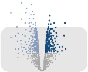

# volcaNoseR: Effortless Volcano Plot Exploration and Visualization

#### Use app online: __[www.shinyappstore.com/a/volcaNoseR](https://shinyappstore.com/a/volcaNoseR)__

volcaNoseR is a Shiny app for generating and nosing around volcano plots. A volcano plot is a widely used data visualization tool in genomics and statistical analysis. It typically displays gene expression data, where each point represents a gene, with the x-axis indicating the fold change in gene expression between two conditions, and the y-axis representing the statistical significance of that change. The VolcaNoseR app allows user-defined cut-offs for the fold-change and significance. Lists with top candidates are shown and these can be annotated in the plot. In addition, user-selected candidates can be added as labels to the plot. Article: Sci Rep. 2020 Nov 25;10(1):20560. doi: 10.1038/s41598-020-76603-3.
